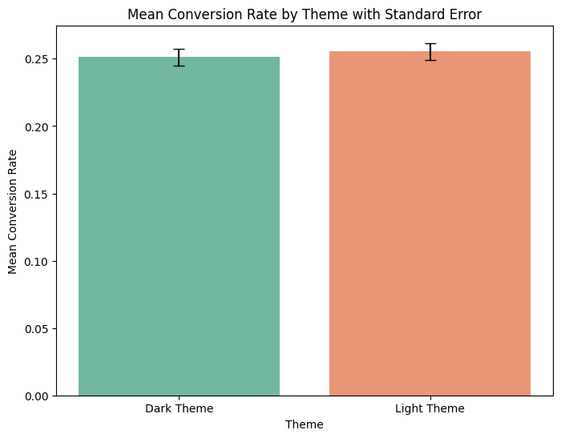

# A/B Testing of Website Themes for Enhanced User Engagement & Conversion

This repository contains the analysis of an A/B test conducted to determine the optimal website theme for improving key business metrics. The project demonstrates a structured approach to hypothesis testing, from data cleaning and exploratory analysis to statistical inference and actionable recommendations.

## Table of Contents

- [A/B Testing of Website Themes for Enhanced User Engagement \& Conversion](#ab-testing-of-website-themes-for-enhanced-user-engagement--conversion)
  - [Table of Contents](#table-of-contents)
  - [Executive Summary](#executive-summary)
  - [Problem Statement \& Business Goal](#problem-statement--business-goal)
  - [Hypothesis Formulation](#hypothesis-formulation)
  - [The Dataset](#the-dataset)
  - [Methodology \& Analysis Pipeline](#methodology--analysis-pipeline)
  - [Key Findings \& Results](#key-findings--results)
  - [Conclusion \& Recommendations](#conclusion--recommendations)
    - [**Recommendation: Maintain Current Theme and Reallocate Resources**](#recommendation-maintain-current-theme-and-reallocate-resources)

---

## Executive Summary

| Category | Description |
|---|---|
| **Objective** | To statistically determine whether a new "Dark Theme" performs better than the existing "Light Theme" in terms of user engagement and conversion. |
| **Methodology**| A randomized controlled experiment was conducted with 1,000 users. User interaction data was analyzed using descriptive statistics, visualizations, and inferential statistical tests (Chi-Squared for categorical data and Independent T-tests for continuous data). |
| **Key Finding** | The choice of theme does not appear to have a statistically significant impact on the likelihood of a purchase in this dataset. |
| **Recommendation**| Based on the data, my primary recommendation is to not proceed with rolling out Dark Theme across the website. |

---

## Problem Statement & Business Goal

The company is looking to refresh its website's user interface to improve user satisfaction and drive sales. A visually appealing and intuitive theme can significantly reduce bounce rates and guide users more effectively through the conversion funnel. However, choosing a theme based on subjective opinion is risky and can lead to a decline in performance.

The goal of this project is to use a rigorous A/B testing framework to provide a data-driven answer to the question: **Which theme should we use to maximize user engagement and conversion?**

Success will be measured by improvements in the following key metrics:

- **Primary Metrics:** Conversion Rate, Click-Through Rate (CTR)
- **Secondary Metrics:** Session Duration, Bounce Rate, Scroll Depth

---

## Hypothesis Formulation

To ensure a statistically sound analysis, we define our hypotheses before testing. We will use a significance level (alpha) of **α = 0.05**.

- **Null Hypothesis (H₀):** There is *no statistically significant difference* in the key performance metrics (Conversion Rate, Session Duration, etc.) between users exposed to Light Theme and users exposed to Dark Theme.
- **Alternative Hypothesis (H₁):** There *is a statistically significant difference* in the key performance metrics between users exposed to Light Theme and Dark Theme.

If the p-value for a given metric is less than 0.05, we will reject the null hypothesis and conclude that the observed difference is statistically significant.

---

## The Dataset

The dataset contains 1,000 records of user interactions, with each user randomly assigned to either Theme A or Theme B.

**Data Dictionary:**

| Column | Description | Data Type |
|---|---|---|
| `Theme` | The theme shown to the user (Theme A or Theme B). | `object` |
| `Click Through Rate` | The percentage of users who clicked a key element. | `float64` |
| `Conversion Rate` | The percentage of users who completed a purchase. | `float64` |
| `Bounce Rate` | The percentage of users who left after viewing only one page. | `float64` |
| `Scroll_Depth` | The percentage of the page the user scrolled down. | `float64` |
| `Age` | The age of the user. | `int64` |
| `Location` | The geographical location of the user. | `object` |
| `Session_Duration` | The total time (in seconds) the user spent on the site. | `int64` |
| `Purchases` | Whether the user made a purchase ('Yes' or 'No'). | `object` |
| `Added_to_Cart` | Whether the user added an item to the cart ('Yes' or 'No'). | `object` |

---

## Methodology & Analysis Pipeline

The analysis was conducted in a Jupyter Notebook (`ab_testing_analysis.ipynb`) and followed these steps:

**1. Data Cleaning and Preprocessing:**

- Checked for and handled missing values (none were found).
- Verified data types.
- Converted categorical `Purchases` and `Added_to_Cart` columns from 'Yes'/'No' strings to binary integers (1/0) for easier aggregation and statistical testing.

```python
# Example of data transformation
df['Purchases_binary'] = df['Purchases'].apply(lambda x: 1 if x == 'Yes' else 0)
df['Added_to_Cart_binary'] = df['Added_to_Cart'].apply(lambda x: 1 if x == 'Yes' else 0)
```

**2. Exploratory Data Analysis (EDA):**

- Visualized the distributions of key metrics using histograms and box plots.
- Compared the average performance of Light Theme vs. Dark Theme using bar charts to identify initial trends.

> **Insight from EDA:** Preliminary visualizations shows there is no statistically significant difference in mean for Conversion Rate and Session Duration.

<!-- Add your image here. Make a folder named 'images' in your repo and put your plots there. -->

*Figure 1: Mean Conversion Rate by Theme with Standard Error. Both themes produced nearly identical mean conversion rates of approximately 25%. The overlapping error bars indicate that there is no statistically significant difference in performance between the Dark and Light themes.*

**3. Statistical A/B Testing:**

- **For Categorical Metrics (e.g., Purchases):** A **Chi-Squared Test of Independence** was used to determine if there is a significant association between the Theme and the likelihood of a purchase.
- **For Continuous Metrics (e.g., Session Duration, CTR):** An **Independent Two-Sample T-test** was used to compare the means of the two groups (Light Theme and Dark Theme). Test assumptions (normality, equal variances) were considered.

---

## Key Findings & Results

The statistical tests provided clear evidence in favor of Theme B.

**Summary of Hypothesis Test Results:**

| Metric | Statistical Test | P-value | Result (at α = 0.05) | Interpretation |
|---|---|---|---|---|
| **Conversion Rate** | Chi-Squared Test | 0.4296 | Fail to Reject H₀ | There is no statistically significant association between Theme and Purchases. |
| **Session Duration** | Independent T-test | 0.7243 | Fail to Reject H₀ |There is no statistically significant difference in session duration between the themes. |
| **Click Through Rate** | Independent T-test | 0.0484 | **Reject H₀** | This suggests a statistically significant difference in Click Through Rate between the themes. |
| **Scroll Depth** | Independent T-test | 0.4495 | Fail to Reject H₀ | The difference in Bounce Rate is not statistically significant. |

---

## Conclusion & Recommendations

The primary goal of this A/B test was to determine if Dark Theme provided a statistically significant improvement over the existing Light Theme, particularly concerning the primary business metric: **purchases**.

The statistical analysis concluded with the following key finding:

- **No Significant Impact on Purchases:** The Chi-Squared test for independence yielded a p-value greater than our significance level of 0.05. Therefore, we **fail to reject the null hypothesis.** This means there is **no statistically significant evidence** to suggest that Theme B is better or worse than Theme A at driving user purchases.

### **Recommendation: Maintain Current Theme and Reallocate Resources**

Based on the data, my primary recommendation is to **not proceed with rolling out Dark Theme** across the website.

This recommendation is based on the following data-driven reasoning:

1. **Lack of Proven ROI:** The experiment did not demonstrate a clear Return on Investment (ROI). Implementing a new site-wide theme requires significant developer time, QA testing, and project management resources. Investing these resources into a change that does not measurably improve our primary business goals is not an efficient use of company capital.

2. **The "If It Ain't Broke, Don't Fix It" Principle:** The existing Light Theme serves as a stable and predictable baseline. The A/B test has effectively de-risked the decision to change, confirming that a purely aesthetic update of this nature is not the key driver for conversion.
