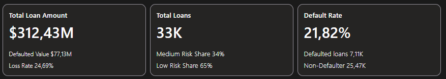
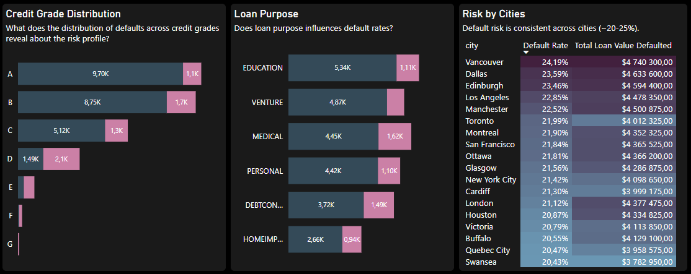

# Credit Risk Report

## **Client Background**

Nova Bank is a diversified financial institution providing a range of loan products—including personal, medical, education, and business loans across the United States, United Kingdom, and Canada. The bank's primary objective is to balance fair and accessible lending with robust risk management. In the current economic climate of late 2025, with rising interest rates, precise and dynamic risk assessment is more critical than ever to maintain a healthy and competitive lending portfolio.

Nova Bank's key challenge is to optimize its lending decisions. Overly permissive lending can lead to financial losses from defaults, while overly strict criteria can result in missed opportunities and alienated potential customers. This analysis aims to provide data-driven insights to help Nova Bank refine its lending policies for both improved safety and fairness.

Nortstar Metrics

## **Executive Summary**

This analysis of Nova Bank's $312.43 million loan portfolio, comprising 33,000 loans, reveals a significant credit risk exposure, with an overall **default rate of 21.82%** by loan count and a **financial loss rate of 24.69%**, amounting to over **$77 million in defaulted loan value**. Our findings indicate that credit risk is not evenly distributed across the portfolio; rather, it is highly concentrated and predictable based on specific loan and borrower characteristics.

**Key Findings:**

1.  **Credit Grade is the Primary Indicator of Risk:** The bank's internal credit grading system is a powerful predictor of loan performance. While Grade A loans have a manageable default rate, risk escalates dramatically with lower grades. **Grade D represents a critical tipping point**, where the number of defaults (2.1K) exceeds performing loans (1.49K), indicating an extremely high probability of loss for this segment and below.

2.  **Loan Purpose Influences Default Rates:** Borrowers seeking loans for **Debt Consolidation and Medical expenses exhibit the highest propensity to default**. In contrast, loans for Education and Personal use carry a comparatively lower risk, suggesting that the underlying reason for borrowing is a key factor in repayment behavior.

3.  **Geographic Location is Not a Major Differentiator:** Despite operating across multiple cities in the USA, UK, and Canada, the analysis shows that default risk is remarkably consistent, with rates clustering tightly between **20% and 25% across all major cities**. This suggests that risk is driven more by borrower profiles and loan terms than by regional economic factors.

**Recommendations:**

*   **Tighten Underwriting for High-Risk Grades:** Immediately review and strengthen lending criteria for loans graded D and lower. Consider ceasing origination in these segments or implementing significantly higher interest rates and lower loan-to-value ratios to compensate for the inherent risk.
*   **Price Risk According to Loan Purpose:** Adjust risk models and pricing to account for the higher default rates associated with Debt Consolidation and Medical loans.
*   **Focus on Borrower-Centric Risk Factors:** Since geography is not a strong risk driver, resources should be focused on refining the assessment of individual borrower financial health, such as debt-to-income ratios and credit history, which are likely stronger predictors.

## **Dataset**

Dataset provided by Nova Bank, contains over 32k individual loan records, each described by over 35 distinct fields. These fields encompass a comprehensive range of information, including borrower profile, loan characteristics (purpose, amount, grade), and key financial health indicators such as debt-to-income ratios and credit history.

## **Insights Deep-Dive**

###  **Borrower Risk Profile**

An analysis of borrower demographic and behavioral patterns reveals distinct profiles that correlate strongly with the likelihood of default. While some traditional risk indicators hold true, others present surprising nuances.

image

#### **Age and Income: A Critical Interplay**

The analysis pinpoints low-income brackets as the primary source of portfolio risk.
*   **The Low-Income Hazard Zone:** Individuals earning less than $25,000 per year consistently have the highest default rates across all age groups, frequently exceeding 50%. The **45-54 age bracket in this income group is particularly vulnerable, with a default rate of 60.98%**.
*   **Income as a Mitigating Factor:** As income increases, default rates generally and significantly decrease. For most age groups, reaching an income level of $50k-$100k cuts the default risk by more than half compared to the lowest bracket.
*   **A Note on Younger High-Earners:** An interesting anomaly exists for the 25-34 age group, where the default rate for those earning over $500k (18.75%) is higher than for those earning $200k-$500k (13.43%). This may suggest lifestyle inflation or business-related volatility among young, high-income individuals.

#### **Credit History: Experience Reduces Risk, But With Nuances**

The length of a borrower's credit history provides a clear, albeit nuanced, picture of their risk profile.

*   **Short History, High Risk:** The data confirms that borrowers with a **"Short" credit history are the riskiest segment**, posting the highest default rate (approximately 22.5%). This group also represents the largest volume of total loans, making them a significant area of concern.
*   **The Stability of Medium History:** As borrowers build a **"Medium" length credit history (~6-10 years), their default rate drops** to its lowest point (around 20.5%), indicating that an established track record is a sign of reliability.
*   **Volatility in Long Histories:** Counterintuitively, the default rate becomes more volatile and trends slightly upward for borrowers with very long credit histories (10+ years). This could be attributed to a smaller sample size in this segment or reflect changing financial circumstances later in life.

#### **Home Ownership: The Clearest Indicator of Stability**

Home ownership status is the single most powerful demographic predictor of repayment behavior in the dataset. There is a stark divide between borrowers who own property and those who do not.

*   **High Risk:** Borrowers who **rent** or fall into the **"Other"** category exhibit exceptionally high default rates of **32% and 31%**, respectively. These groups represent a significantly higher risk to the portfolio.
*   **Low Risk:** In contrast, **homeowners (7%)** and those with a **mortgage (13%)** are substantially more reliable. The default rate for outright owners is over four times lower than for renters, suggesting that property ownership serves as a strong proxy for financial stability and commitment

### **Loan Characteristics Analysis**

Beyond the borrower's profile, the inherent characteristics of the loan itself—its grade, size relative to income, interest rate, purpose, and term—are critical drivers of portfolio risk. This analysis reveals that how a loan is structured is a powerful predictor of its performance, providing clear levers for Nova Bank to adjust its lending strategy.

#### **Loan Grade: The Core of the Risk Model**

The bank's internal loan grading system is a highly effective, albeit stark, predictor of default. The data confirms a direct and exponential relationship between loan grade and risk, validating the model's accuracy while also highlighting the extreme risk concentrated in the lower grades.

*   **The Tipping Point at Grade D:** While Grades A, B, and C show a manageable, incremental increase in risk (9.96% to 20.73% default rate), **Grade D represents a critical cliff**. The default rate skyrockets to **59.05%**, meaning the majority of loans in this segment fail. The financial loss rate mirrors this, jumping from 22.82% for Grade C to 57.96% for Grade D.
*   **Extreme Risk in Lower Grades:** Loans graded E, F, and G are almost certain to result in losses. **Grade G loans have a staggering 98.44% default rate and a 99.85% loss rate**, indicating that lending to this segment is financially unsustainable.

#### **Loan-to-Income Ratio: A Critical Affordability Threshold**

The Loan-to-Income (LTI) ratio, which measures the loan amount as a percentage of the borrower's annual income, is a fundamental indicator of affordability and subsequent repayment ability.

*   **Linear Risk Progression:** The analysis shows a clear and direct correlation: as the LTI ratio increases, the default rate climbs steadily. Borrowers with an LTI below 0.2 have a default rate under 25%, while those with an LTI above 0.6 see default rates approaching 60%.
*   **Compounding Risk:** Not only does the default rate increase, but the average loan amount also grows with the LTI ratio. This creates a dangerous combination where the bank is lending larger sums of money to individuals who are progressively less capable of repaying.

#### **Loan Rate Impact: High Rates Signal High-Risk Borrowers**

Interest rates are not just a tool for profit but also a reflection of perceived risk. The data shows that the bank's risk-based pricing is functioning as intended, but it also reveals the perilous nature of the high-rate segment of the portfolio.

*   **The Volume vs. Risk Trade-off:** The majority of loans are issued at interest rates below 15%. As rates increase, the volume of loans sharply decreases, while the default rate skyrockets.
*   **High-Rate = High Default:** The borrower segment with interest rates of 20% or more has a default rate approaching 80%. This confirms that these are the riskiest clients, and while they are few in number, they contribute significantly to the overall loss rate.

#### **Loan Intent Performance: Motivation Matters**

The reason a borrower seeks a loan is a strong indicator of their underlying financial situation and their likelihood of defaulting.

*   **Distress-Based Borrowing is Riskiest:** Loans for **Debt Consolidation** and **Medical** purposes carry the highest default rates (approximately 28% and 26%, respectively). This suggests these loans are often taken out of financial necessity or distress, making repayment more challenging.
*   **Investment-Based Borrowing is Safest:** Conversely, loans for **Venture** (business) and **Education** are the best-performing, with the lowest default rates. These loans are typically viewed as investments in future income-generating potential, which may correlate with a higher commitment to repayment.

#### **Loan Term Analysis: A Non-Linear Relationship**

Contrary to the common belief that longer terms always equal higher risk, the data shows a more nuanced, U-shaped relationship between loan term and default rate.

*   **Short-Term Stability:** 12-month (Short) loans have the lowest default rate (around 20%). These are likely smaller, more manageable loans that are easier to repay quickly.
*   **The Surprising 24-Month Spike:** The default rate unexpectedly jumps for 24-month loans before declining for 36-month terms and then rising again for 60-month (Long) terms. This could indicate that 24-month terms are occupied by a riskier pool of borrowers who do not qualify for either very short or longer-term financing.

### **Early Warning Indicators**

Proactive risk management is critical to reducing financial losses. By combining key behavioral and financial metrics, we have developed a model to identify borrowers exhibiting early signs of financial distress. This system has currently flagged **122 active accounts** as "High-Risk Profiles" that require immediate attention.

An analysis of these flagged accounts reveals a consistent and alarming pattern of three key indicators:

1.  **Prior Delinquency is a Universal Red Flag:** **100% of the borrowers** on this high-risk list have a history of at least one delinquency. This is the single most powerful early warning sign, indicating a breakdown in their ability to manage existing financial commitments.

2.  **Extreme Credit Utilization:** These borrowers are heavily reliant on revolving credit. The average **Credit Utilization Ratio (CUR) for this group is over 70%** (e.g., CUST_00369 at 93.72%, CUST_00131 at 94.10%). A CUR this high signals that the individual has nearly exhausted their available credit and has little to no financial flexibility to handle unexpected expenses.

3.  **Unsustainable Debt Burden:** The **Debt-to-Income (DTI) ratios are consistently high**, frequently exceeding 0.60 (60%). For instance, CUST_00131 has a DTI of 0.81. This indicates that a large majority of the borrower's income is already dedicated to servicing existing debt, leaving a very slim margin for new loan repayments.

## **Recommendations**

##  **Borrower Risk Profile**

## **Loan Characteristics Analysis**

## **Early Warning Indicators**

